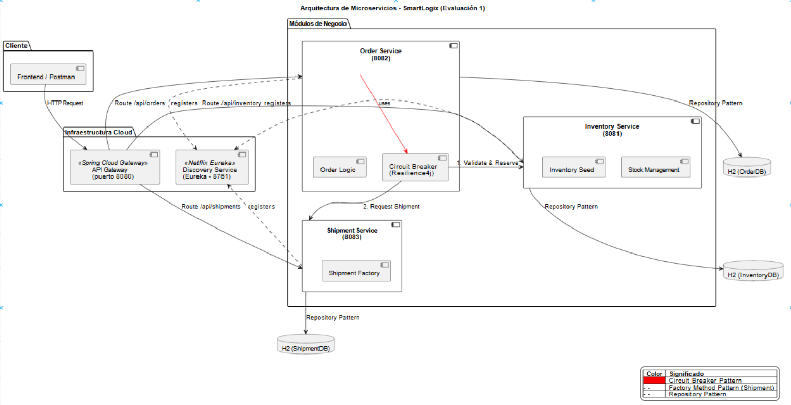
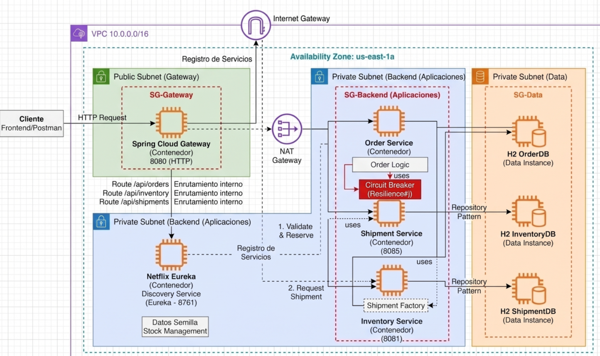

# DUOC UC  
**Integrantes:** Mirko Lucic / Ashley Vargas

**Asignatura:** Desarrollo Fullstack III – Semestre 01 2026  
**Profesor:** Anyelo Castellon Rios  

# INFORME DE FULLSTACK III  
**Caso:** SmartLogix 

---

## 1. Contexto y Necesidades del Cliente

El comercio electrónico ha experimentado un crecimiento exponencial en el mercado actual. Este fenómeno ha dejado en evidencia las múltiples deficiencias presentes en los sistemas logísticos tradicionales.

Actualmente, las PYMEs enfocadas en el eCommerce operan bajo las siguientes limitaciones:

- Dependencia de sistemas con arquitectura monolítica.  
- Ejecución de procesos de manera estrictamente manual.  

### Consecuencias Operativas

Este modelo tradicional genera una serie de impactos negativos en la operación diaria:

- Inconsistencias en el flujo de información.  
- Errores frecuentes en la asignación de los pedidos.  
- Demoras significativas en los tiempos de envío hacia el cliente final.  

### Propuesta de Solución: SmartLogix

Para resolver estas problemáticas, SmartLogix requiere el desarrollo e implementación de una solución tecnológica moderna, basada fundamentalmente en una arquitectura de microservicios.

### Objetivos del Nuevo Sistema

Esta nueva arquitectura permitirá alcanzar los siguientes hitos:

- Automatizar de manera integral la gestión logística.  
- Soportar picos de alta demanda sin degradación del servicio.  
- Reducir considerablemente los costos operativos de la empresa.  

### Requerimientos Técnicos Principales

La necesidad principal y el núcleo del proyecto consiste en realizar una migración hacia un backend que cumpla con los siguientes atributos de calidad:

- Escalabilidad  
- Seguridad  
- Flexibilidad  

### Integración de Dominios

Este nuevo backend deberá ser capaz de integrar, de manera totalmente desacoplada, los siguientes procesos clave:

- Gestión y control de inventarios.  
- Procesamiento eficiente de pedidos.  
- Coordinación y seguimiento de envíos.  

---

## 2. Propuesta Arquitectónica y Microservicios Clave

Para dar solución al caso, se diseñó una arquitectura distribuida separando las responsabilidades en los siguientes módulos clave:

### - **API Gateway (Puerto 8080):**  
  Actúa como punto único de entrada para el frontend o los clientes, enrutando las peticiones al microservicio correspondiente y ocultando la complejidad de la red interna.

### - **Discovery Service (Puerto 8761 - Eureka):**  
  Implementa el patrón *Service Discovery*, permitiendo que los microservicios se registren dinámicamente y se comuniquen entre sí mediante nombres lógicos en lugar de IPs estáticas.

### - **Inventory Service (Puerto 8081):**  
  Gestiona los niveles de stock en tiempo real. Permite consultar disponibilidad, reservar y liberar productos.

### - **Order Service (Puerto 8082):**  
  Es el orquestador del sistema. Automatiza la validación de pedidos, verificando el stock en el inventario y solicitando el despacho al servicio de envíos de manera síncrona.

### - **Shipment Service (Puerto 8083):**  
  Coordina los envíos, determinando el transportista adecuado y los tiempos de entrega estimados según la zona geográfica del cliente.

### Diagrama de arquitectura de los microservicios

---

## 3. Justificación de Patrones de Arquitectura

Se seleccionaron estándares actuales de la industria para garantizar la resiliencia y el bajo acoplamiento del sistema:

### Database per Service y Repository Pattern

- Cada microservicio cuenta con su propia base de datos (H2 en memoria para esta etapa), asegurando que los datos estén encapsulados.  
- El acceso a datos se maneja mediante Repository Pattern (Spring Data JPA), lo que desacopla la lógica de negocio de la capa de persistencia.  
- Facilita futuras migraciones a bases de datos relacionales productivas (como MySQL o PostgreSQL).  

### Factory Method

- Implementado en el Shipment Service.  
- Se utiliza una fábrica (*ShipmentPlanFactoryResolver*) para instanciar planes de envío específicos (Norte, Centro, Sur) según la dirección de destino.  
- Permite agregar nuevas zonas o transportistas en el futuro sin modificar la lógica central del servicio.  

### Circuit Breaker (Resilience4j)

- Implementado en el Order Service para las llamadas al servicio de envíos.  
- Este patrón previene fallos en cascada: si el Shipment Service no responde, el circuito se abre y ejecuta un método de respaldo (*fallback*), marcando la orden para "asignación manual" sin bloquear la experiencia del usuario ni colapsar los recursos del servidor.  

---

## 4. Consideraciones Éticas  
### Seguridad, Privacidad y Sostenibilidad

La propuesta arquitectónica no solo cumple con requerimientos funcionales, sino que aborda aspectos éticos fundamentales:

### Seguridad

- Al utilizar un API Gateway, se reduce la superficie de ataque.  
- Los puertos internos (8081, 8082, 8083) no se exponen directamente a Internet, protegiendo los servicios de negocio.  
- Se proyecta la integración de seguridad JWT para las próximas etapas.  

### Privacidad (Aislamiento de Datos)

- Gracias al patrón Database per Service, los datos sensibles de los clientes (como correos y direcciones almacenados en Orders) están físicamente separados de los datos logísticos y de stock.  
- Minimiza el impacto en caso de una vulnerabilidad en un servicio específico.  

### Sostenibilidad (Eficiencia de Recursos)

- La arquitectura basada en contenedores (Docker) permite una escalabilidad granular.  
- En momentos de baja demanda, se pueden apagar instancias redundantes de servicios específicos (ej. inventario), reduciendo el consumo energético y la huella de carbono en la infraestructura Cloud.  
- A diferencia de un sistema monolítico que debe estar 100% encendido todo el tiempo.  

---

### Diagrama de arquitectura de la infraestructura

## 5.Conclusiones

La arquitectura diseñada para SmartLogix representa una solución moderna y definitiva para los problemas logísticos de las PYMEs, destacando los siguientes logros:

### **-Evolución Tecnológica:** 
Transición exitosa de un sistema monolítico tradicional a un ecosistema de microservicios altamente escalable y autónomo.

### **-Resiliencia y Desacoplamiento:** 
Implementación estratégica de patrones de software (Database per Service, Factory Method y Circuit Breaker) que garantizan la independencia de los módulos y previenen fallos en cascada.

### **-Seguridad y Privacidad:** 
Diseño de una infraestructura de red segmentada mediante VPC y Subredes que protege los datos sensibles de los clientes y blinda los servicios internos.

### **-Proyección a Futuro:** 
Entrega de una base técnica robusta capaz de automatizar procesos, soportar picos de demanda y asegurar la continuidad operativa del negocio ante cualquier escenario.
